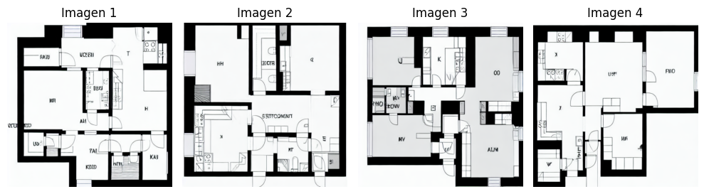
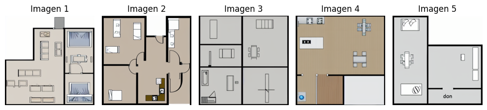

# Project Floorify-TFM

## Descripción en Español:

Este repositorio tiene como objetivo almacenar los códigos y pruebas realizados en las fases de experimentación del proyecto Floorify.

El proyecto Floorify fue un objeto de investigación experimental, realizado en el marco del proceso de estancia I+D+i en informática con la empresa HP SCDS (España) y en el desarrollo del TFM (Trabajo Fin de Máster), con el propósito de obtener el título de máster en el curso de Ingeniería Informática de la Universidad de Valladolid, en España.

El propósito de la investigación realizada para este trabajo fue experimentar si sería posible crear un modelo inteligente capaz de generar imágenes de planos arquitectónicos (plantas bajas) a partir de una descripción textual con filtros proporcionada en el momento de la inferencia sobre el modelo.

Para la creación del modelo, utilizamos la técnica de Fine-Tuning sobre modelos ya entrenados de Stable Diffusion, empleando como base principal el modelo Diffusion de la plataforma Hugging Face, con los métodos Dreambooth, LoRa y Text_To_Image.

## English Description:

This repository aims to store the codes and tests conducted during the experimental phases of the Floorify project.

The Floorify project was an object of experimental research, carried out within the framework of the R&D+i process in computer science in collaboration with the company HP SCDS (Spain) and during the development of the Master's Final Project (TFM), with the purpose of obtaining the master's degree in the Computer Engineering program at the University of Valladolid, Spain.

The purpose of the research conducted for this work was to explore whether it would be possible to create an intelligent model capable of generating architectural floor plan images (ground plans) based on a textual description with filters provided at the time of inference.

For the model's creation, we used the Fine-Tuning technique on pre-trained Stable Diffusion models, leveraging the Diffusion model from the Hugging Face platform as the main foundation, along with the Dreambooth, LoRa, and Text_To_Image methods.

## Imagenes de Demonstracion de Pruebas Generados:

#### Inferencia con el Metodo Text_to_Image 

#### Inferencia con el Metodo LoRas/Dreambooth 

## Demonstration Test Images Generated:

#### Inference with the Text_to_Image Method 

#### Inference with the LoRas/Dreambooth Method 

## Instalación y Métodos para Utilizar el Proyecto

El proyecto almacenado en este repositorio fue generado a partir del lenguaje de programación Python, convirtiéndose en el requisito principal para cualquier persona que desee realizar pruebas y experimentos con el proyecto.
En el archivo "xxx", una vez ejecutado dentro del entorno operativo con Python, se instalan automáticamente todas las bibliotecas utilizadas en el proyecto. Dejo el comando a continuación:

```bash
   python interface_gradio.py
```

Es necesario descargar la carpeta de algoritmos y modelos de Diffusion para realizar los fine-tunings si se desea. A continuación, dejo el comando y la carpeta de almacenamiento en el proyecto:

```bash
   python interface_gradio.py
```

Para ejecutar la generación de los principales modelos, siempre es necesario ejecutar el archivo XXX, que ejecuta una interfaz Gradio para realizar los experimentos, siempre y cuando ya exista un modelo ajustado en la carpeta. Dejo el comando a continuación:

```bash
   python interface_gradio.py
```

## Installation and Methods to Use the Project

The project stored in this repository was developed using the Python programming language, making it the primary requirement for anyone wishing to conduct tests and experiments with the project.
In the file "xxx," once executed within the Python environment, all libraries used in the project are automatically installed.

It is necessary to download the folder containing the Diffusion algorithms and models to perform fine-tunings if desired. Below, I provide the command and the storage folder in the project:

```bash
   python interface_gradio.py
```

To execute the generation of the main models, it is always necessary to run the XXX file, which launches a Gradio interface to perform the experiments, as long as an adjusted model already exists in the folder. I leave the command below:

```bash
   python interface_gradio.py
```

## Citation

```bibtex
@misc{eufrasio-etal-2025-floorify,
  author = {Giovane Eufrasio},
  title = {Proyecto Floorify: Generación de Planos Arquitectónicos Mediante Inteligencia Artificial Generativa},
  year = {2025},
  publisher = {GitHub},
  journal = {GitHub repository},
  howpublished = {\url{https://github.com/Gi-Eufrasio/Floorify-TFM}}
}
```